<div align="center">
      
     <h1>Welcome to Netlas CookBook!</h1>
      
      <br>
     
      
     <br>
     <br>
  The goal of this guide is very simple - to teach anyone interested in cyber security, regardless of their knowledge level, how to make the most of Netlas.io.
</div>


# Table of contents

- [What is Netlas.io?](#what-is-netlasio)
- [Simple usage examples](#simple-usage-examples) 
  - [Getting information about IP or domain](#getting-information-about-ip-or-domain)
  - [Looking for websites that contain a certain word in their title](#looking-for-websites-that-contain-a-certain-word-in-their-title)
- [Search query syntax](#search-query-syntax)
  - [Filters (Fields)](#filters-fields)
  - [Logical operators](#logical-operators)
  - [Ranges](#ranges)
  - [Fuzzines](#fuzziness)
  - [Regular expressions](#regular-expressions)
  - [Other Netlas.io search features](#other-netlasio-search-features) 
- [API requests](#api-requests)
  - [How to find the API key](#how-to-find-the-api-key)
  - [Tools for debugging API requests](#tools-for-debugging-api-requests)
  - [Structure of Netlas API JSON response](#structure-of-netlas-api-json-response)
  - [Tools for working with data in JSON format](#tools-for-working-with-data-in-json-format)
  - [Netlas Python Library](#netlas-python-library)
  - [Examples of response keys for getting useful data](#examples-of-response-keys-for-getting-useful-data)
  - [Netlas CLI Tools](#netlas-cli-tools)
  - [Search vs downloads methods](#search-vs-download-methods)
  - [Make requests with Python (without Netlas Python Library](#make-requests-with-python-without-netlas-python-library)
  - [Examples for other programming languages](#examples-for-other-programming-languages)
     - [NodeJS](#nodejs)
     - [Ruby](#ruby)
     - [Bash](#bash)
  - [JQ Utility](#jq-utility)
  - [AI tools for writing code](#ai-tools-for-writing-code)
  - [Code checkers](#code-checkers)
 - [Using Netlas.io for OSINT](#using-netlasio-for-osint-open-source-intelligence)
   - [Search person's nickname or email in WHOIS contacts](#search-persons-nickname-or-email-in-whois-contacts)
   - [Search person's nickname or email in title and body of web page](#search-persons-nickname-or-email-in-title-and-body-of-web-page)
   - [Phone number mentions search](#phone-number-mentions-search)
   - [Search file mentions (looking for content that may be infringing on copyrights)](#search-file-mentions-looking-for-content-that-may-be-infringing-on-copyrights)
   - [Domain WHOIS information gathering](#domain-whois-information-gathering)
   - [Search subdomains](#search-subdomains)
   - [Search location in \<address\> tag](#search-location-in-address-tag)
   - [Search author name in meta tags](#search-author-name-in-meta-tags)
 - [Using Netlas.io for Pentest](#using-neltas-for-pentest)
    - [Search for sites with specific vulnerabilities](#search-for-sites-with-specific-vulnerabilities)
    - [Search for sites with vulnerabilities that contain a certain word in their descriptions](#search-for-sites-with-vulnerabilities-that-contain-a-certain-word-in-their-descriptions)
    - [Search by server http header](#search-by-server-http-header)
- [Common problems](#common-problems)
     - [Error 429 - Too frequent requests](#error-429---too-frequent-requests)
     - [KeyError](#keyerror)


# What is Netlas.io?


Search engine to find and analyse information about all IP addresses and domains available on the Internet. Netlas has some attack surface management features, but this guide is focused mostly on Netlas search tools and how to use them in automations.

Netlas.io includes several search tools:


- **IP/Domain info** [→](https://app.netlas.io/host/)   
- **Response search** [→](https://app.netlas.io/responses/)  
- **DNS search** [→](https://app.netlas.io/domains/)   
- **IP WHOIS search** [→](https://app.netlas.io/whois/ip/)   
- **Domain WHOIS search** [→](https://app.netlas.io/whois/domains/)   
- **Certificates search** [→](https://app.netlas.io/certs/)  


Surface management tools are in development:

- **Attack Surface Discovery Tool** [→](https://app.netlas.io/asd/)  

  
Some of the databases collected by Netlas.io can be purchased from the **Datastore** [→](https://app.netlas.io/datastore/)  

You can also integrate Netlas.io services into your applications using **API** [→](https://netlas.io/api)  


# Simple usage examples


Before we get into the technical details, let's see how [Netlas.io](https://app.netlas.io/) works with a few simple examples.


## Getting information about IP or domain


Open [Netlas.io IP/Domain info](https://app.netlas.io/host/netlas.io/) and enter the domain name or IP. The following information will be displayed as a result:

* whois data (registrant, location, emails, phones)
* related domains
* MX and NS records
* exposed ports & software (sometimes additionally displays information about vulnerabilities)


## Looking for websites that contain a certain word in their title


Open [Netlas.io response search](https://app.netlas.io/responses/) and enter:


```
http.title:g*thub
```

[Try in Netlas](https://app.netlas.io/responses/?q=http.title%3Ag*thub&page=1&indices=)


This will find all servers whose HTTP titles contain the word starts with "g" and ends to "thub". Read more about using asterisks below.


# Search query syntax


Now let's learn more about how search queries work in [Netlas.io](https://app.netlas.io/). 

Netlas.io based on [Elasticsearch](https://github.com/elastic/elasticsearch), free and open, distributed, RESTful search engine. And the search methods in Netlas.io are very similar to those of other Elasticsearch-based databases. 


## Filters (Fields)

Response, DNS, IP and Certificates search allow you to use filters (fields) in search queries. For example:


```
http.body:netlas
```

[Try in Netlas](https://app.netlas.io/responses/?q=http.body%3Anetlas&page=1&indices=)

You can use this query to find pages which contain the word "netlas" inside their <body> html tag.


A list of available filters for each search type is displayed on the right side of the page.


Filters allow you to search for servers based on many different parameters. For example:


* domain
* ip
* protocol
* certificate
* cve
* geolocation (city, continent, country, lat and long)

and many others.


## Logical operators

You can use multiple filters in a single query and combine them using logical operators AND, OR, NOT. For example:


```
http.title:netlas NOT port:443
```

[Try in Netlas](https://app.netlas.io/responses/?q=http.title%3Anetlas%20NOT%20port%3A443&page=1&indices=)


If you want to combine multiple conditions in your query, use parentheses:


```
http.title:(netlas OR shodan) NOT port:443
```

[Try in Netlas](https://nt.ls/OrFOY)


## Ranges


If you use a numeric value as the value of a field, you can designate it asa value from and to (extreme limits of the value range):


```
ip:[173.194.222.0 TO 173.194.222.255] 
```


[Try in Netlas](https://app.netlas.io/responses/?q=ip%3A%5B173.194.222.0%20TO%20173.194.222.255%5D%20&page=1&indices=)


Or mark only the upper or only the lower limit of the value:


```
host:"1.1.1.1" port:<=1000
```

[Try in Netlas](https://app.netlas.io/responses/?q=host%3A%221.1.1.1%22%20port%3A%3C%3D1000&page=1&indices=)


## Wildcards


If you don't know the exact description of a certain character in your query (for example, you don't know the exact zone for a domain or the spelling of a name), you can replace it with an asterisk:


```
domain:google.*
```


[Try in Netlas](https://app.netlas.io/responses/?q=domain%3Agoogle.*&page=1&indices=)


You can also use question mark:


```
domain:google.?
```

[Try in Netlas](https://app.netlas.io/responses/?q=domain%3Agoogle.%3F&page=1&indices=)

Asterisk - many symbols, question mark - one symbol.


## Fuzziness

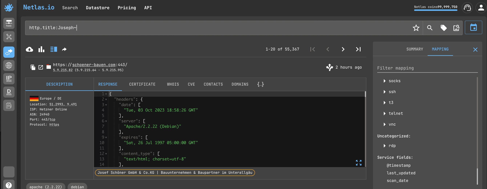

If you need to search not by exact, but by approximate value of a field (for example, pages whose titles contain all names consonant with Joseph), just add ~ to the query:


```
http.title:Joseph~
```

[Try in Netlas](https://app.netlas.io/responses/?q=http.title%3AJoseph~&page=1&indices=)

## Regular expressions


Regular expressions - it is a sequence of characters that allows you to search for, retrieve and replace pieces of text in a source document that match certain patterns. For example:

* ([a-zA-Z0–9+._-]+@[a-zA-Z0–9._-]+\.[a-zA-Z0–9_-]+) - any email address
* <.*?> - any html tag
* ^[\+]?[(]?[0-9]{3}[)]?[-\s\.]?[0-9]{3}[-\s\.]?c{4,6}$ - any phone number
* ^[\+]?[(]?[0-9]{3}[)]?[-\s\.]?[0-9]{3}[-\s\.]?[0-9]{4,6}$ - any Bitcoin address


For more information on using regular expressions, see the examples in the Netlas Cookbook (what you're reading now) and the links below:


[Regex Syntax Manual in Elasticsearch documentation](https://www.elastic.co/guide/en/elasticsearch/reference/current/regexp-syntax.html)

[How regular expressions can be useful in OSINT. Theory and some practice using Google Sheets](https://medium.com/p/31d31efabd5)


## Other Netlas.io search features


### Download results

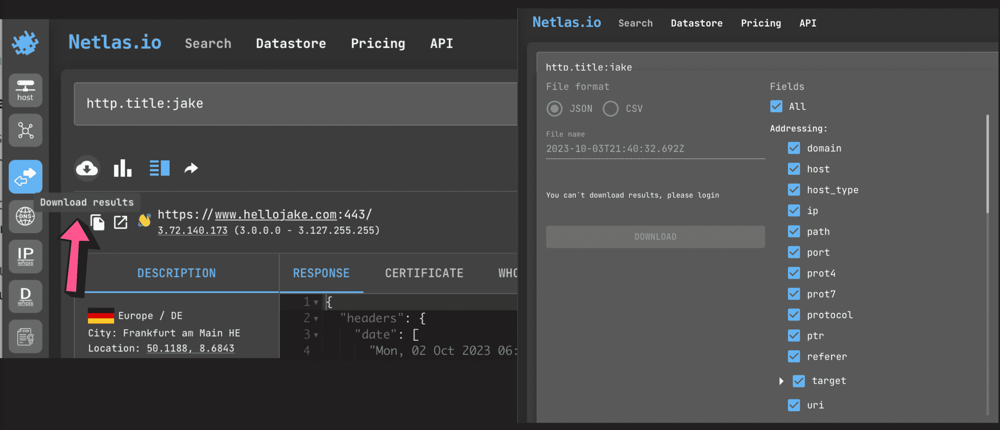

You can save your results (all or selected fields) in JSON and CSV format to view them in a format you like or automatically analyse them with different tools.


### Group results


You can group results by different field values to speed up the search time. For example, by domain name or geolocation.


### Share results

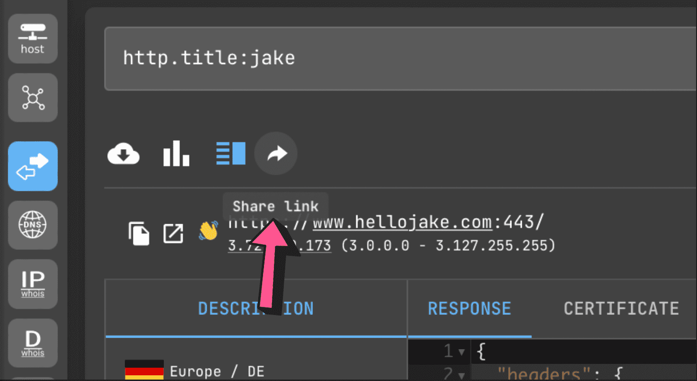

You can freely share links to search results (no registration is required to open them, unless the user has exceeded the free limit of 50 requests).

### Search history


Also remember that all the quiries you have made can be viewed on your profile page (link in the top right corner).


# API requests


Netlas.io's most important function is to help people conduct cybersecurity research faster and more efficiently. The service has an API (application programming interface) that allows you to automate the execution of various requests. 

It can be implemented both in simple Python or Bash scripts of a few lines in length and in complex multifunctional applications.


You can read more about using the Netlas API in the Netlas Cookbook (what you're reading now) or in the official documentation:


[API Documentation](https://netlas-api.readthedocs.io/en/latest/)


## How to find the API-key?


This is the very first place to start with the API. You don't even have to pay for a subscription (50 requests per day are free). Just go to [profile page](https://app.netlas.io/profile/).


## Tools for debugging API requests

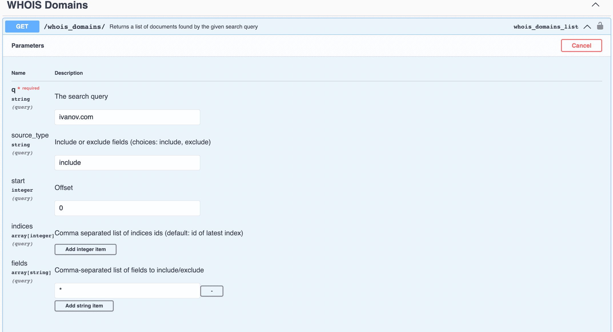


You don't have to write scripts or create applications to start using the Netlas API. You can simply test it using our online tool [Netlas schema](https://app.netlas.io/schema).


Firstly, click "Authorize" and enter API key. Secondly, select API method, click "Try it out/", enter search query (and other parameters) and click "Execute".


Netlas scheme is still under development and you may find its analogs designed for testing different APIs more convenient:

[Reqbin](https://reqbin.com/)

[ExtendClass Online Rest Client](https://extendsclass.com/rest-client-online.html)


## Structure of Netlas API JSON response 


Similar to other APIs, the Netlas API response consists of headers and a response body in JSON (JavaScript Object Notation) format. JSON files contain data in key-value format and can be analysed using almost any programming language.


If you use Netlas Shema, you can copy or download the response body and view it in any text editor or JSON analyser.


## Tools for working with data in JSON format

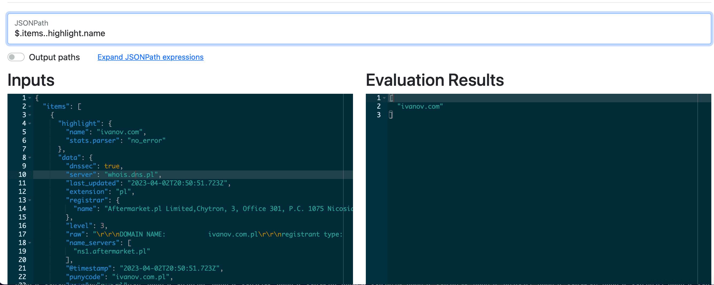


A little tip that will come in handy when writing code using the Netlas API. In order to understand the structure of a JSON file faster and find the path to get a certain value, use special tools such as:

[JSON Path Online Evaluator](https://jsonpath.com)


[JSON Path Finder](https://jsonpathfinder.com)


## Netlas Python library


The easiest way to automate requests to the Netlas API is to use a specially designed Python library (package).


[Netlas-Python library Github repo](https://github.com/netlas-io/netlas-python)

[Netlas Python Library Documentation](https://netlas-python.readthedocs.io/en/latest/)


Let's see how it works with a simple example. All code samples from Netlas Cookbook are located in the **scripts** folder. You can clone this repository and run them on your device:


```shell
git clone https://github.com/netlas-io/netlas-cookbook
```


If you haven't run a Python scripts before today and don't know how to do it, you can start by open Netlas CookBook repository in Gitpod.
Gitpod is a cloud development environment based on Ubuntu (Linux distribution). Just open this link in your browser (log in with your Github account):

[Run Netlas Cookbook in Gitpod](https://gitpod.io#https://github.com/netlas-io/netlas-cookbook)


Install Netlas Python library using pip (package installer for Python). Enter in the command line:


```shell
pip install netlas

```

Check the installation. Enter in the command line:

```shell
netlas --help
```

Run netlas_python_example.py:


```shell
python scripts/netlas_python_example.py:
```


And of course, you can just copy the code and save to files. Here is the code of the first example:


```python
import netlas

apikey = "YOUR_API_KEY"

# create new connection to Netlas
netlas_connection = netlas.Netlas(api_key=apikey)

# retrieve data from responses by query `port:7001`
netlas_query = netlas_connection.query(query="port:7001")

# iterate over data and print: IP address, port, path and protocol
for response in netlas_query['items']:
    print(f"{response['data']['ip']}:{response['data']['port']}{response['data']['path']} [{response['data']['protocol']}]")
pass

```

## Examples of response keys for getting useful data


It's mentioned above that in order to find JSON patches of API response to get the data you need, you can use special online applications (JSON-evaluators). To make your life even better, here is a small list of examples of Python library response keys that are needed most often.


```python


# Main domain/ip info

response['data']['uri']
response['data']['ip']
response['data']['http']['title']
response['data']['http']['meta']
response['data']['http']['body']


# Geo info


response['data']['geo']['continent']
response['data']['geo']['country']
response['data']['geo']['city']
response['data']['geo']['location']['lat']
response['data']['geo']['location']['long']


# Whois geo info

response['data']['whois']['net']['country']
response['data']['whois']['net']['address']
response['data']['whois']['net']['city']
response['data']['whois']['net']['contacts']['emails']
response['data']['whois']['net']['contacts']['phones']


# Http status and favicon ico info

response['data']['port']
response['data']['http']['status_code']
response['data']['http']['status_line']
response['data']['http']['favicon']['image']
response['data']['http']['favicon']['path']


# Basic CVE info 

response['data']['cve'][0]['name']
response['data']['cve'][0]['description']
response['data']['cve'][0]['base_score']
response['data']['cve'][0]['has_exploit']
response['data']['cve'][0]['exploit_links']

```


## Netlas CLI Tools


You can also use the Netlas Python Library directly from the command line. For example:


```
netlas search "http.title:johnsmith" -f json >results.json
```


This simple command searches for all servers that have the word johnsmith in their header, returns the results in JSON format, and stores the results in the resutls.json file.


All other features of the Netlas API can be used in the same way. You can learn more about this from the help (-h command) and examples in the Netlas Cookbook (what you are reading now).


```
Usage: netlas [OPTIONS] COMMAND [ARGS]...

Options:
  -h, --help  Show this message and exit.

Commands:
  count           Calculate count of query results.
  download        Download data.
  host            Host (ip or domain) information.
  indices         Get available data indices.
  profile         Get user profile data.
  savekey         Save API key to the local system.
  search (query)  Search query.
  stat            Get statistics for query.
```


Before running different Netlas CLI Tools commands, save the API key in the settings:


```
netlas savekey YOUR_API_KEY
```


We also have a Github repository with a couple of examples of automating various tasks using bash script and Netlas CLI tools:


[Netlas Scripts](https://github.com/netlas-io/netlas-scripts)


## Search vs Download methods


The Netlas API has many methods, but the most commonly used methods are search and download. They are very similar to each other, but still have some differences.


The search method loads one page of results (20 items) at a time and allows a maximum of 200 pages to be loaded (20*200=4000 items). The download method downloads all results (but requires much more resources to execute).


## Make requests with Python (without Netlas Python Library)


You may find it easier in some cases not to use the Netlas Python Library, but to use the standard Python request package, which is familiar to many developers:

Enter in the command line:


```
python scripts/python_example.py
```


Source code of python_example.py:

```python
import requests

response = requests.get("https://app.netlas.io/api/domains/?q=ivanov.com&source_type=include&start=0&fields=*",{'X-API-Key': 'YOUR API KEY'})

print(response.json())

```


But Netlas Python Library is still preferable as it is designed to deal with different problems with query processing (errors, long waits, etc.).


## Examples for other programming languages


While we recommend using our Python Library to automate Netlas search, it's worth noting that the Netlas API can be built into most applications with a wide variety of technology stacks. The main thing is that it should be able to make **REST requests** and **parse JSON** data.


Here are some examples in different popular programming languages.


### NodeJS 

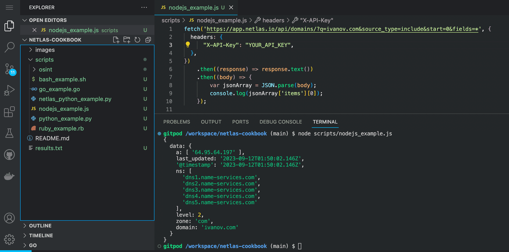


Enter in the command line:

```
node scripts/node_example.js
```


If you are not using Gitpod, you should have [NodeJS]([https://nodejs.org/en/download) installed on your device.


Source code of nodejs_example.js:


```javascript

fetch('https://app.netlas.io/api/domains/?q=ivanov.com&source_type=include&start=0&fields=*', {
  headers: {
      "X-API-Key": "YOUR_API_KEY",
  },
})
    .then((response) => response.text())
    .then((body) => {
        var jsonArray = JSON.parse(body);
        console.log(jsonArray['items'][0]);
    });

```


### Ruby 


Enter in the command line:


```
ruby scripts/ruby_example.rb
```

If you are not using Gitpod, you should have [Ruby]([https://go.dev/doc/install](https://www.ruby-lang.org/en/documentation/installation/) installed on your device.


Source code of ruby_example.rb:


```ruby

require 'net/http'
require 'uri'
require 'json'


uri = URI("https://app.netlas.io/api/domains/?q=ivanov.com&source_type=include&start=0&fields=*")
req = Net::HTTP::Get.new(uri)
req['X-API-Key'] = "YOUR_API_KEY"

res = Net::HTTP.start(uri.hostname, uri.port, use_ssl: uri.scheme == 'https') { |http|
  http.request(req)
}

jsonArray = JSON.parse(res.body)

puts jsonArray['items'][0]['data']['domain']

```


### Bash 


Enter in the command line:


```
bash scripts/bash_example.sh
```

Source code of bash_example.sh:


```
curl -X 'GET' \
  'https://app.netlas.io/api/domains/?q=ivanov.com&source_type=include&start=0&fields=*' \
  -H 'accept: application/json' \
  -H 'X-API-Key: YOUR_API_KEY' | jq .items[0].data.last_updated

```

Don't forget that [Netlas Schema](https://app.netlas.io/schema/) automatically generates sample bash scripts (with curl command) for each request. 


## JQ Utility

Note that in the example above, the JQ utility was used to extract fields from JSON data. 

It is sometimes referred to as "like sed for JSON data".  It is a surprisingly handy tool for working with any JSON data. Here are some syntax examples.


Print firt item of JSON-array:

```
.items[0] 
```

Print all items of JSON-array:

```
.items[]
```


Print all 'data' subitems of first item of JSON-array:


```
.['items'][0]['data'][]
```


Print all sub-subitems for each item of JSON-array:

```
.items[].data.technical[]
```


You can read more about JQ here (I recommend paying special attention to data filtering):


[JQ utility documentation](https://jqlang.github.io/jq/)


## AI tools for writing code


If you encounter any problems when customising the Netlas Cookbook examples, we recommend that you seek help from AI tools for improving and writing code. For example:


[ChatGPT](https://chat.openai.com/)  
[Code Llama](https://huggingface.co/spaces/codellama/codellama-playground)  
[You.com](https://you.com/)  


When working with such services, you just need to describe in words the task you want to solve with the help of code.


## Code checkers
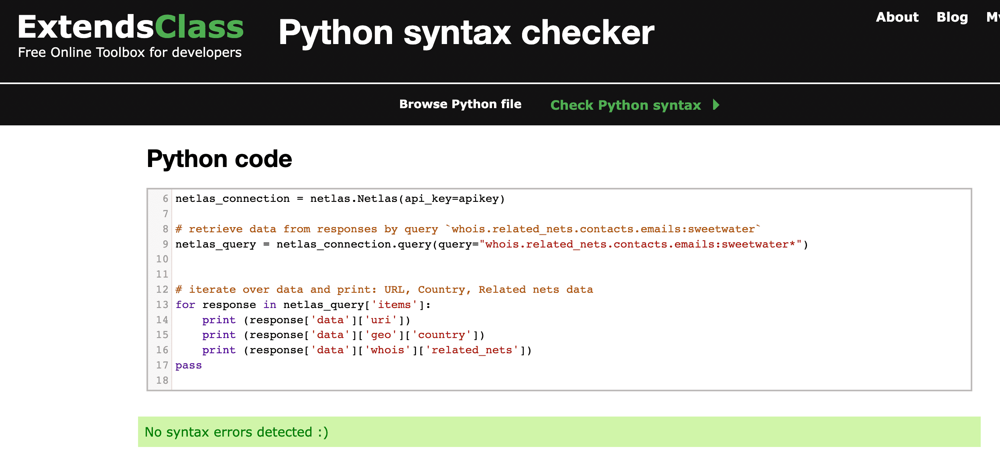

When you rework the Netlas Cookbook examples to suit your purposes, you may find that the code will not execute from some errors. Special online tools can help you find and fix them:  

[ExtendsClass Python Tester](https://extendsclass.com/python-tester.html)
[PythonChecker](https://www.pythonchecker.com)
[Snyk](https://snyk.io/code-checker/python/)


If you don't want to copy your code to third-party services, you can check it for errors on your device using the Pylint (static code analyser):

[Pylint Python Package](https://pypi.org/project/pylint/)


# Using Netlas.io for OSINT (Open Source Intelligence)


Netlas.io can help you gather data about a domain or company, as well as find mentions of a person (or anyone) in internet. 

It can also be used to find old versions of web pages (as an analogue of the Wayback Machine).


## Search person's nickname or email in WHOIS contacts


Most often WHOIS data contains only the contact information of the company registering the domains. But sometimes there may be personal contacts of persons of interest. This query will help you find them.  

*This method may require a paid subscription.* [See the pricing](https://app.netlas.io/plans/)

**Search query example**  


```
whois.related_nets.contacts.emails:sweetwater
```

[Try in Netlas](https://app.netlas.io/responses/?q=whois.related_nets.contacts.emails%3Asweetwater&page=1&indices=)

**API request example**


Netlas CLI Tools:


```
netlas search "whois.related_nets.contacts.emails:sweetwater*" -f json
```


Curl:

```
curl -X 'GET' \
  'https://app.netlas.io/api/responses/?q=whois.related_nets.contacts.emails%3Asweetwater*&fields=' \
  -H 'accept: application/json' \
  -H 'X-API-Key: aqkd8L4MR93Tkcaz2UXDXrRleV8Vlvbv' | jq .items[].data.uri
```


**Code example (Netlas Python Library)**

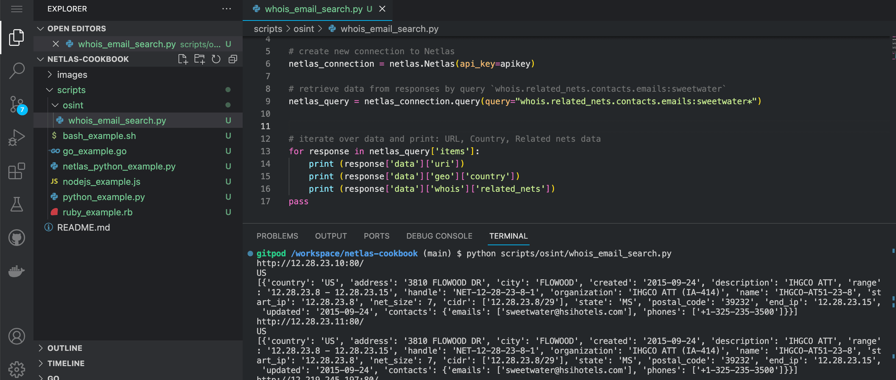


Run in command line:


```
python scripts/osint/whois_email_search.py
```


Source code of scripts/osint/whois_email_search.py:

```python

import netlas

apikey = "YOUR_API_KEY"

# create new connection to Netlas
netlas_connection = netlas.Netlas(api_key=apikey)

# retrieve data from responses by query `whois.related_nets.contacts.emails:sweetwater`
netlas_query = netlas_connection.query(query="whois.related_nets.contacts.emails:sweetwater*")


# iterate over data and print: URL, Country, Related nets data
for response in netlas_query['items']:
    print (response['data']['uri'])
    print (response['data']['geo']['country'])
    print (response['data']['whois']['related_nets'])
pass

```


## Search person's nickname or email in title and body of web page


Netlas allows you to search for mentions of certain words in headings and in the html code of web pages. You can search for words by exact match, by approximate match (see the fuzzy queries section) and replace characters you are not sure of with asterisks.


**Search query example**  


```
http.title:sweetwater OR http.body:sweetwater
```

[Try in Netlas](https://app.netlas.io/responses/?q=http.title%3Asweetwater%20OR%20http.body%3Asweetwater&page=1&indices=)


**API request example**


Netlas CLI Tools:


```
netlas search "http.title:sweetwater OR http.body:sweetwater" -f json
```


Curl:


```
curl -X 'GET' \
  'https://app.netlas.io/api/responses/?q=whois.related_nets.contacts.emails%3Asweetwater*&fields=' \
  -H 'accept: application/json' \
  -H 'X-API-Key: YOUR_API_KEY' | jq .items[].data.uri
```


**Code example (Netlas Python Library)**


Run in command line:


```
python scripts/osint/title_body_search.py
```


Source code of scripts/osint/title_body_search.py:

```python

import netlas

apikey = "YOUR_API_KEY"

# create new connection to Netlas
netlas_connection = netlas.Netlas(api_key=apikey)

# retrieve data from responses by query `http.title:sweetwater OR http.body:sweetwater`
netlas_query = netlas_connection.query(query="http.title:sweetwater OR http.body:sweetwater*")


# iterate over data and print: IP,URL,web page title
for response in netlas_query['items']:
    print (response['data']['ip'])
    print (response['data']['uri'])
    print (response['data']['http']['title'])
pass

```


## Phone number mentions search


As with nicknames and emails, you can also look for mentions of a phone number in the code of web pages or WHOIS contact information. 

We single out this task as a separate example, because searching for a phone number is complicated by the fact that it can be written in different formats.


**Search query example**  


```
http.body:1?234?567?89?99 OR http.body:12345678999 OR http.body:1234?5678?999
```


[Try in Netlas](https://app.netlas.io/responses/?q=http.body%3A1%3F234%3F567%3F89%3F99%20OR%20http.body%3A12345678999%20OR%20http.body%3A1234%3F5678%3F999&page=1&indices=)


When making a request, you should take into account the format of telephone number recording, which is accepted in the country, which owns the phone number you are interested in.


**API request example**


Netlas CLI Tools:


```
netlas search "http.body:1?234?567?89?99 OR http.body:12345678999 OR http.body:1234?5678?999" -f json
```


Don't forget that you can search for phone numbers not only in the body of the page, but also in the WHOIS contact information. This can be done using the filter **whois.related_nets.contacts.phones:**


Curl:


```
curl -X 'GET' \
  'https://app.netlas.io/api/responses/?q=http.body%3A1%3F234%3F567%3F89%3F99%20OR%20http.body%3A12345678999%20OR%20http.body%3A1234%3F5678%3F999&source_type=include&start=0&fields=*' \
  -H 'accept: application/json' \
  -H 'X-API-Key: YOUR_API_KEY' jq .items[].data.uri
```


**Code example (Netlas Python Library)**


Run in command line:


```
python scripts/osint/phonenumber_search.py
```


Source code of scripts/osint/phonenumber_search.py:

```python

import netlas

apikey = "YOUR_API_KEY"

# create new connection to Netlas
netlas_connection = netlas.Netlas(api_key=apikey)

# retrieve data from responses by query `http.body:1?234?567?89?99 OR http.body:12345678999 OR http.body:1234?5678?999`
netlas_query = netlas_connection.query(query="http.body:1?234?567?89?99 OR http.body:12345678999 OR http.body:1234?5678?999")


# iterate over data and print: ip, url
for response in netlas_query['items']:
    print (response['data']['ip'])
    print (response['data']['uri'])
pass

```


## Search file mentions (looking for content that may be infringing on copyrights)


Let's imagine that you are a musician and you want to find all the sites where your tracks are posted. You can do this by searching for pages that mention your name and have links to files with the .mp3 extension.

**Search query example**  


```
(http.title:alla OR http.body:alla) AND http.body:*.mp3

```

[Try in Netlas](https://nt.ls/HEhJj)


**API request example**


Netlas CLI Tools:


```
netlas search "(http.title:alla OR http.body:alla) AND http.body:*.mp3" -f json
```


Curl:


```
curl -X 'GET' \
  'https://app.netlas.io/api/responses/?q=(http.title%3Aalla%20OR%20http.body%3Aalla)%20AND%20http.body%3A*.mp3&source_type=include&start=0&fields=*' \
  -H 'accept: application/json' \
  -H 'X-API-Key: YOUR_API_KEY' |  jq .items[].data.http.title
```


**Code example (Netlas Python Library)**


Run in command line:


```
python scripts/osint/file_mentions_search.py
```


Source code of scripts/osint/file_mentions_search.py:

```python

import netlas

apikey = "YOUR_API_KEY"

# create new connection to Netlas
netlas_connection = netlas.Netlas(api_key=apikey)

# retrieve data from responses by query `(http.title:alla OR http.body:alla) AND http.body:*.mp3`
netlas_query = netlas_connection.query(query="(http.title:alla OR http.body:alla) AND http.body:*.mp3")


# iterate over data and print: IP, URL,web page title
for response in netlas_query['items']:
    print (response['data']['ip'])
    print (response['data']['uri'])
    print (response['data']['http']['title'])
pass

```


## Domain WHOIS information gathering


WHOIS is a worldwide public database that stores information about all registered domains in the world. 


**Search query example**  

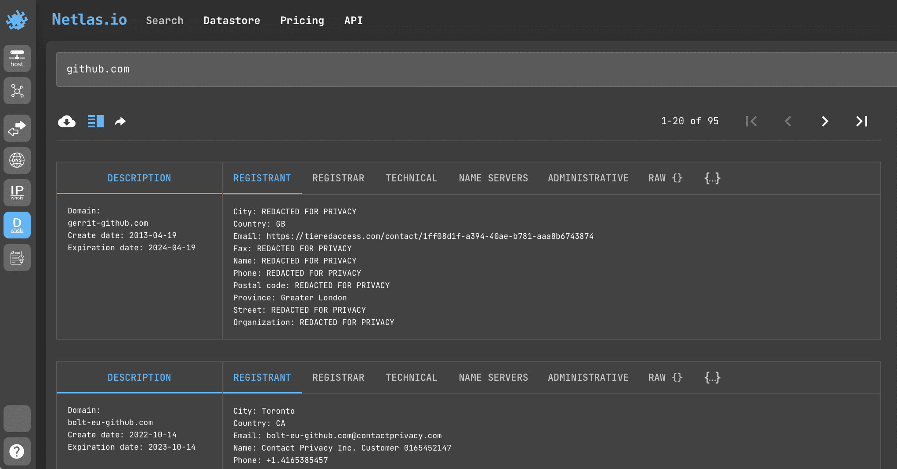

Use [WHOIS Domain search](https://app.netlas.io/whois/domains/)

```
github.com
```


**API request example**


Netlas CLI Tools:


```
netlas host github.com -f json
```


Curl:


```
curl -X 'GET' \
  'https://app.netlas.io/api/whois_domains/?q=github.com&source_type=include&start=0&fields=*' \
  -H 'accept: application/json' \
  -H 'X-API-Key: YOUR_API_KEY' |  jq .items[].data.technical.street
```


**Code example (Netlas Python Library)**


Run in command line:


```
python scripts/osint/whois_search.py
```


Source code of scripts/osint/whois_search.py:

```python

import netlas

apikey = "YOUR_API_KEY"

# create new connection to Netlas
netlas_connection = netlas.Netlas(api_key=apikey)

# retrieve data from whois for google.com domain
netlas_query = netlas_connection.query(query="google.com",datatype="whois-domain")


# iterate over data and print: owner name
for response in netlas_query['items']:
    print (response['data']['technical']['name'])  
pass


```


## Search subdomains


By using asterisks in search queries, you can find all subdomains of different levels (whose name ends with the name of a particular first-level domain (.com) or second-level domain (google.com).

**Search query example**  


```
domain:*.github.com OR host:*.github.com
```


[Try in Netlas](https://app.netlas.io/responses/?q=domain%3A*.github.com%20OR%20host%3A*.github.com&page=1&indices=)


**API request example**


Netlas CLI Tools:


```
netlas search "domain:*.github.com OR host:*.github.com" -f json
```


Curl:


```
curl -X 'GET' \
  'https://app.netlas.io/api/responses/?q=domain%3A*.github.com%20OR%20host%3A*.github.com&source_type=include&start=0&fields=*' \
  -H 'accept: application/json' \
  -H 'X-API-Key: YOUR_API_KEY' | jq .items[].data.uri
```


**Code example (Netlas Python Library)**


Run in command line:


```
python scripts/osint/subdomain_search.py
```


Source code of scripts/osint/subdomain_search.py:

```python

import netlas

apikey = "YOUR_API_KEY"

# create new connection to Netlas
netlas_connection = netlas.Netlas(api_key=apikey)

# retrieve data from responses by query `domain:*.github.com OR host:*.github.com`
netlas_query = netlas_connection.query(query="domain:*.github.com OR host:*.github.com")


# iterate over data and print: ip, url
for response in netlas_query['items']:
    print (response['data']['ip'])
    print (response['data']['uri'])
pass

```

## Search location in \<address\> tag

\<address\> tag is located inside the \<head\> tag of a web page and may contain physical addresses. With a search using this tag, you can find sites associated with a particular street, and sometimes even a particular building.

**Search query example**  


```
http.contacts.address:kirby
```

[Try in Netlas](https://app.netlas.io/responses/?q=http.contacts.address%3Akirby&page=1&indices=)


You can also use http.contacts.email: for email search.


**API request example**


Netlas CLI Tools:


```
netlas search "http.contacts.address:kirby" -f json
```


Curl:


```

curl -X 'GET' \
  'https://app.netlas.io/api/responses/?q=http.contacts.address%3Akirby&source_type=include&start=0&fields=*' \
  -H 'accept: application/json' \
  -H 'X-API-Key: 'YOUR_API_KEY' | jq .items[].data.http.contacts

```


**Code example (Netlas Python Library)**


Run in command line:


```
python scripts/osint/contacts_search.py
```


Source code of scripts/osint/contacts_search.py:

```python

import netlas

apikey = "YOUR_API_KEY"

# create new connection to Netlas
netlas_connection = netlas.Netlas(api_key=apikey)

# retrieve data from responses by query `http.contacts.address:kirby`
netlas_query = netlas_connection.query(query="http.contacts.address:kirby")


# iterate over data and print: URL, Contacts
for response in netlas_query['items']:
    print (response['data']['uri'])
    print (response['data']['http']['contacts'])
pass

```


##  Search author name in meta tags

\<meta\> tags are located inside the \<head\> tag of a web page and contain the most important keywords, description, miscellaneous service information and the author's name. 

Searching for nickname and name/surname by meta tags (http.meta) allows you to find sites associated with a particular person faster than searching the entire html code (http.body).


**Search query example**  

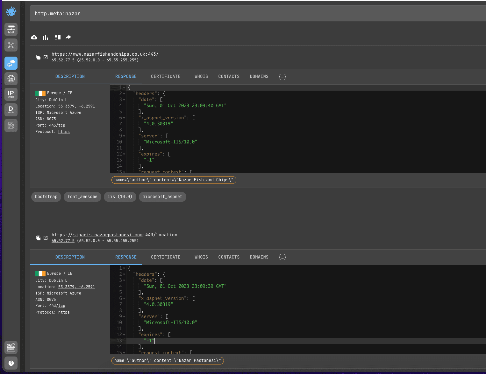


```
http.meta:nazar
```

[Try in Netlas](https://app.netlas.io/responses/?q=http.meta%3Anazar&page=1&indices=)


**API request example**


Netlas CLI Tools:


```
netlas search "http.meta:nazar" -f json
```


Curl:


```

curl -X 'GET' \
  'https://app.netlas.io/api/responses/?q=http.meta%3Anazar&source_type=include&start=0&fields=*' \
  -H 'accept: application/json' \
  -H 'X-API-Key: YOUR_API_KEY' | jq .items[].data.http.meta

```


**Code example (Netlas Python Library)**

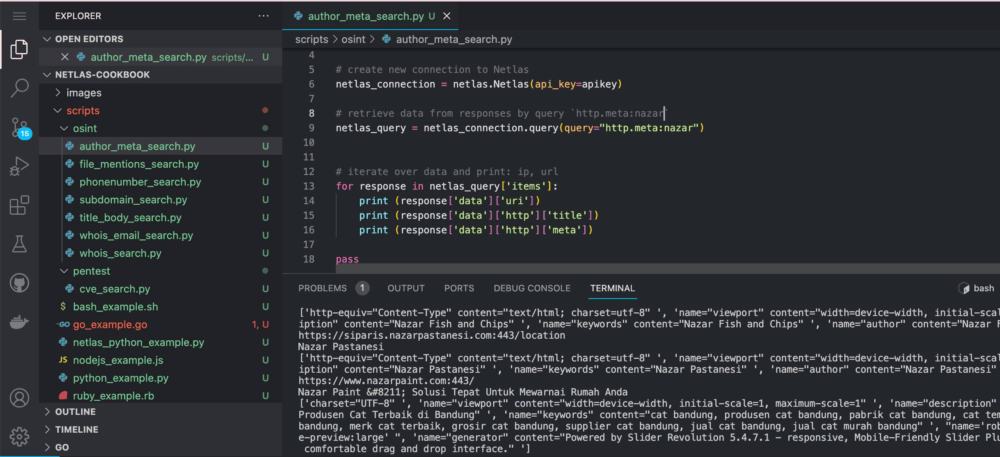


Run in command line:


```
python scripts/osint/author_meta_search.py
```


Source code of scripts/osint/author_meta_search.py:

```python

import netlas

apikey = "YOUR_API_KEY"

# create new connection to Netlas
netlas_connection = netlas.Netlas(api_key=apikey)

# retrieve data from responses by query `http.meta:nazar`
netlas_query = netlas_connection.query(query="http.meta:nazar")


# iterate over data and print: ip, url
for response in netlas_query['items']:
    print (response['data']['uri'])
    print (response['data']['http']['title'])
    print (response['data']['http']['meta'])
    
pass

```


# Using Neltas for Pentest


## Search for sites with specific vulnerabilities


As with nicknames and emails, you can also look for mentions of a phone number in the code of web pages or WHOIS contact information. 

We single out this task as a separate example, because searching for a phone number is complicated by the fact that it can be written in different formats.


**Search query example**  

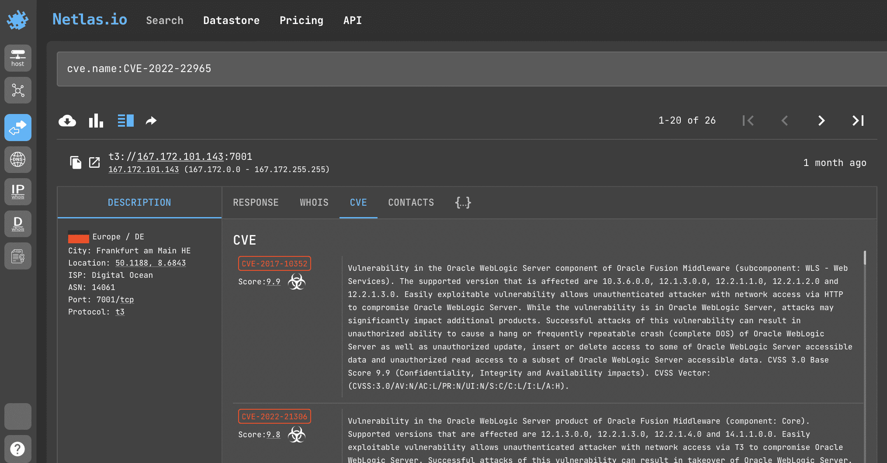


```
cve.name:CVE-2022-22965
```

[Try in Netlas](https://app.netlas.io/responses/?q=cve.name%3ACVE-2022-22965&page=1&indices=)


**API request example**


Netlas CLI Tools:


```
netlas search "cve.name:CVE-2022-22965" -f json
```


CVE-2022-22965 - Spring MVC or Spring WebFlux application running on JDK 9+ may be vulnerable to remote code execution (RCE) via data binding. [Details](https://nvd.nist.gov/vuln/detail/cve-2022-22965)


Curl:


```
curl -X 'GET' \
  'https://app.netlas.io/api/responses/?q=http.body%3A1%3F234%3F567%3F89%3F99%20OR%20http.body%3A12345678999%20OR%20http.body%3A1234%3F5678%3F999&source_type=include&start=0&fields=*' \
  -H 'accept: application/json' \
  -H 'X-API-Key: YOUR_API_KEY' jq .items[].data.uri
```


**Code example (Netlas Python Library)**

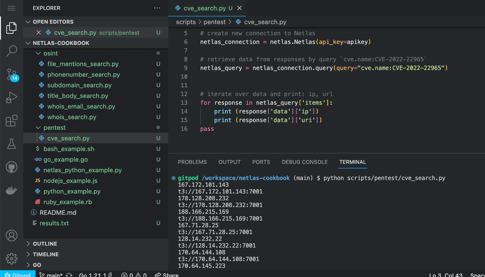


Run in command line:


```
python scripts/pentest/cve_search.py
```


Source code of scripts/pentest/cve_search.py:

```python

import netlas

apikey = "YOUR_API_KEY"

# create new connection to Netlas
netlas_connection = netlas.Netlas(api_key=apikey)

# retrieve data from responses by query `cve.name:CVE-2022-22965`
netlas_query = netlas_connection.query(query="cve.name:CVE-2022-22965")


# iterate over data and print: ip, url
for response in netlas_query['items']:
    print (response['data']['ip'])
    print (response['data']['uri'])
pass

```


## Search for sites with vulnerabilities that contain a certain word in their descriptions


If you don't need to investigate servers with a specific type of vulnerability, but just want to see vulnerable servers in a specific group (such as Oracle WebLogic Server or WordPress sites), you can search for them using keywords and the cve.description: filter. 

To filter out sites that have exploits published for vulnerabilities, use cve.has_exploit:true.


**Search query example**  


```
cve.description:weblogic AND cve.has_exploit:true
```

[Try in Netlas](https://app.netlas.io/responses/?q=cve.description%3Aweblogic%20AND%20cve.has_exploit%3Atrue&page=1&indices=)


**API request example**


Netlas CLI Tools:


```
netlas search "cve.description:weblogic AND cve.has_exploit:true" -f json
```


Curl:


```

curl -X 'GET' \
  'https://app.netlas.io/api/responses/?q=cve.description%3Aweblogic%20AND%20cve.has_exploit%3Atrue&source_type=include&start=0&fields=*' \
  -H 'accept: application/json' \
  -H 'X-API-Key: YOUR_API_KEY | jq .items[].data.uri

```


**Code example (Netlas Python Library)**


Run in command line:


```
python scripts/pentest/cve_description_search.py
```


Source code of scripts/pentest/cve_description_search.py:

```python

import netlas

apikey = "YOUR_API_KEY"

# create new connection to Netlas
netlas_connection = netlas.Netlas(api_key=apikey)

# retrieve data from responses by query `cve.description:weblogic AND cve.has_exploit:true`
netlas_query = netlas_connection.query(query="cve.description:weblogic AND cve.has_exploit:true")


# iterate over data and print:  url, first CVE name first CVE description
for response in netlas_query['items']:
    print (response['data']['uri'])
    print (response['data']['cve'][0]['name'])
    print (response['data']['cve'][0]['description'])
    
pass

```


## Search by server http header


This method allows you to find devices manufactured by a specific company.

**Search query example**  


```
http.headers.server:"yawcam"
```


Search YawCam web cams.


[Try in Netlas](https://app.netlas.io/responses/?q=http.headers.server%3A%22yawcam%22&page=1&indices=)


**API request example**


Netlas CLI Tools:


```
netlas search 'http.headers.server:"yawcam"' -f json
```

Note that when double quotes are used in queries, the query itself is written inside single quotes.

Curl:


```
curl -X 'GET' \
     'https://app.netlas.io/api/responses/?q=http.headers.server%3A%22yawcam%22&source_type=include&start=0&fields=*' \
  -H 'accept: application/json' \
  -H 'X-API-Key: YOUR_API_KEY' | jq .items[].data.uri
```


**Code example (Netlas Python Library)**


Run in command line:


```
python scripts/pentest/server_name_search.py
```


Source code of scripts/pentest/server_name_search.py:

```python

import netlas

apikey = "YOUR_API_KEY"

# create new connection to Netlas
netlas_connection = netlas.Netlas(api_key=apikey)

# retrieve data from responses by query `http.headers.server:"yawcam"`
netlas_query = netlas_connection.query(query='http.headers.server:"yawcam"')


# iterate over data and print: IP, URL, server name
for response in netlas_query['items']:
    print (response['data']['ip'])
    print (response['data']['http']['headers']['server'])
  
   
pass

```


# Common problems


## Error 429 - Too frequent requests


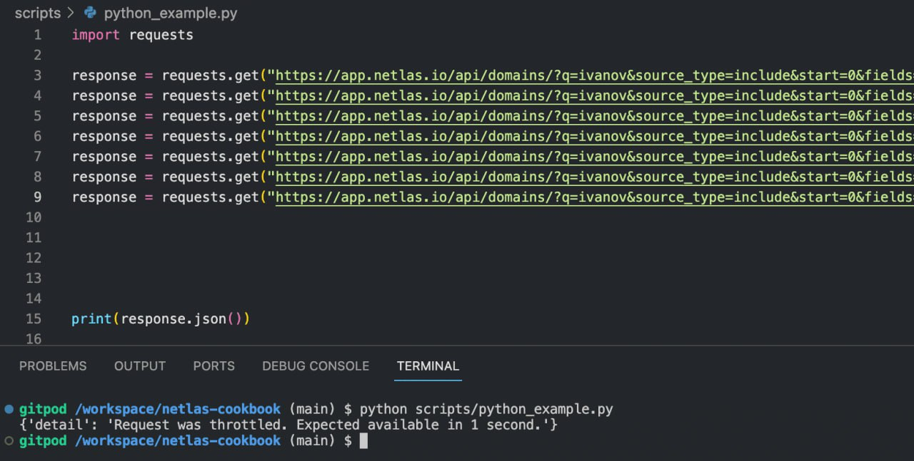

If your application includes multiple requests to the Netlas API, you may encounter this error:

```python
{'detail': 'Request was throttled. Expected available in 1 second.'}
```

One way to solve this problem is to use special Python libraries to configure time limits on query execution, such as [Limiter Package](https://pypi.org/project/ratelimit/). 


Here is an example of its use in code (limit of no more than 60 requests per minute). First, install package:

```
pip install ratelimit
```

And run rate_limit.py:

```python
import netlas
from ratelimit import limits

# One call - one second
@limits(calls=1, period=1)
def netlas_query():
     apikey = "YOUR_API_KEY"

     # create new connection to Netlas
     netlas_connection = netlas.Netlas(api_key=apikey)

     # retrieve data from responses by query `cve.description:weblogic AND cve.has_exploit:true`
     netlas_query = netlas_connection.query(query="cve.description:weblogic AND cve.has_exploit:true")


     # iterate over data and print:  url, first CVE name first CVE description
     for response in netlas_query['items']:
        print (response['data']['uri'])
        print (response['data']['cve'][0]['name'])
        print (response['data']['cve'][0]['description'])

pass

netlas_query()

```
Similar packages exist for other popular programming languages, as exceeding the request limit is a very common problem when working with almost most APIs. 


If you really need to make more than one enquiry per second, you can write to the sales team to solve your problem on a case-by-case basis - **sales@netlas.io**

## KeyError


Another common problem is the lack of a specific key in response for some servers. For example, ['data']['http']['title'] is quite often missing.

If the key is missing, the script stops executing. Standard error handling will help to avoid this. For example:

```python
try:
       print (response['data']['http']['title'])
    except:
        print ("no title")

```


## To be contininued... Stay tuned!

Want to know about Netlas Cookbook updates? 


👁️ Subscribe for updates


⭐️ Give us a star to show your appreciation


* [Twitter](https://twitter.com/Netlas_io)
* [Telegram](https://t.me/netlas)
* [Medium](https://netlas.medium.com/)
* [Linkedin](https://www.linkedin.com/company/netlas-io/)


Many thanks [@cyb_detective](https://twitter.com/cyb_detective) for help (https://cybdetective.com)

## License


This work is licensed under a [CC0 1.0 Universal](LICENSE.md) license.


